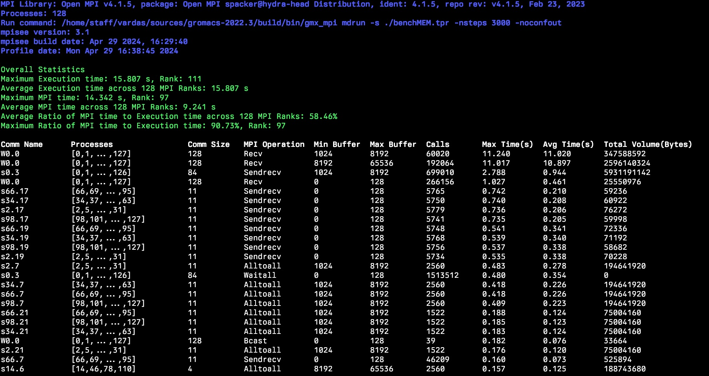

#+title: Readme
* Introduction
=mpisee=, your friendly neighborhood MPI profiler: Reveals communication bottlenecks and uncovers hidden patterns within MPI communicators.
#+attr_html: :width 100%

* Build
** Dependencies
1. C/C++ compiler that supports C++11 standard
2. CMake version > 3.10
3. MPI Library (Open MPI, MPICH, CrayMPICH, MVAPICH, IntelMPI)
4. SQLite library
** Basic build
#+begin_src bash
git clone https://github.com/variemai/communicator_profiler.git && cd communicator_profiler
mkdir build && cd build
cmake .. && make -j
#+end_src
You might need to define the compiler if it is not detected e.g.: ~-DMPI_CXX_COMPILER=mpicxx~
* Usage
- To profile your MPI application make sure it is compiled with the same MPI library as mpisee
- Set ~LD_PRELOAD~ and ~MPISEE_OUTFILE~ variables before running your application
- ~LD_PRELOAD~ to point to the ~libmpisee.so~ created in the build folder
- ~MPISEE_OUTFILE~ defines output file name.
- To get a summary of the results parse the output file with the ~mpisee-through.py~ script located in the ~mpisee-through~ folder
    - For a complete list of options run ~/path/to/mpisee-through.py --help~
** Important Note on Output Files
*Always use a new file name for each profile, overwriting an existing file will distort the output*
** Example Usage
#+begin_src bash
LD_PRELOAD=/path/to/libmpisee.so MPISEE_OUTFILE=/path/to/output.db <mpi launcher> <args> /path/to/exec <args>
python3 /path/to/mpisee-through.py -i /path/to/mpisee_profile.db
#+end_src

** Results analysis with mpisee-through
- The default query displays all data in each communicator by summarizing across ranks: ~/path/to/mpisee-through.py -i /path/to/mpisee_profile.db~
- Display all data by separating ranks: ~/path/to/mpisee-through.py -i /path/to/mpisee_profile.db -a~
- Display data for collective MPI operations only: ~/path/to/mpisee-through.py -i /path/to/mpisee_profile.db -c~
- Display data for point-to-point MPI operations only: ~/path/to/mpisee-through.py -i /path/to/mpisee_profile.db -p~
- The following switches can be combined with the above options:
  - Display data for specific MPI ranks, e.g., Ranks 0 and 12 (cannot be combined with the default query): ~-r 0,12~
  - Display data for a specific buffer range, e.g., 0-1024: ~-b 0:1024~
  - Display data for MPI operations within a specific time range, e.g, from 0.02 to 0.8 seconds: ~-t 0.02:0.8~
* Advanced Build
=mpisee= uses buffer size ranges to categorize the MPI communication calls.
These buffer size categories can be configured by the user for finer grain analysis. The default values are:
~-NUM_BUCKETS=8~ and ~-BUCKETS=128,1024,8192,65536,262144,1048576,33554432~.
| Buffer Range | Bucket |
|--------------+--------|
| 0-128        | 128    |
| 128-1024     | 1024   |
| ...          | ...    |

** Configure Buffer Range Sizes (Buckets)
- Set the ~NUM_BUCKETS~ and ~BUCKETS~ correctly: length of ~BUCKETS~ must be equal to ~NUM_BUCKETS-1~
- Sample build with 9 Buckets:
#+begin_src bash
cmake -DNUM_BUCKETS=9 -DBUCKETS="64,512,4096,8192,65536,262144,1048576,33554432"
#+end_src
*** Important on mpisee-through script
=mpisee-through.py= depends on the ~utils.h~ header file of =mpisee=. If you run =mpisee-through.py= on a different machine from where you configured =mpisee=, make sure that both installations are configured in the same way. Even if =mpisee= does not compile, it will configure the necessary files for the =mpisee-through=.

* Cite
If you found this useful please cite:
[[https://ieeexplore.ieee.org/document/9835659][Link to IEEE Xplore]]
** Bibtex
#+begin_src bibtex
@INPROCEEDINGS{mpisee,
  author={Vardas, Ioannis and Hunold, Sascha and Ajanohoun, Jordy I. and Träff, Jesper Larsson},
  booktitle={2022 IEEE International Parallel and Distributed Processing Symposium Workshops (IPDPSW)},
  title={mpisee: MPI Profiling for Communication and Communicator Structure},
  year={2022},
  volume={},
  number={},
  pages={520-529},
  doi={10.1109/IPDPSW55747.2022.00092}}
#+end_src
